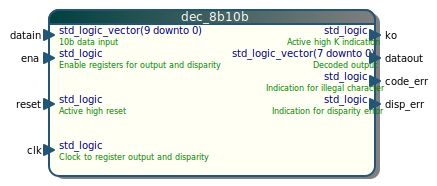
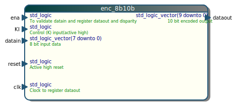

# VHDL 8b10b encoder and decoder
## Overview

This is an implementation of the 8b10b decoder and encoder as described by  Widmer and Franaszek.
The original source (Verilog) was obtained from Chuck Benz http://asics.chuckbenz.com/#My_open_source_8b10b_encoderdecoder

The code was translated into VHDL by Frans Schreuder in 2020. Some changes were also made to the behaviour:
 * Disparity is registered internally in the entities
 * The output is registered 
 * clock and reset pins were added
 * ena inputs added, in case the data is not valid every clockcycle, for instance when used in combination with a gearbox. 
 * **The 10 bit value (output of the encoder, input to the decoder) have a reverse bit-order compared to the original verilog source**





## License
Apache 2.0, see LICENSE.md

## Simulating the testbench (using UVVM)
The simulation testbench depends on the UVVM library, which has been added 
as a submodule of this repository. Before using UVVM, you must initialize 
the submodule and compile UVVM. 

In this example Modelsim 2019.1 was used.

```
git submodule update --init
cd UVVM/script
vsim -do ./compile_all.do -c
cd ../..
```
To launch the actual simulation of the 8b10b encoder / decoder there is a script:
```
cd scripts
vsim -do simulate.tcl
```

## FPGA resources
The modules were synthesized for Xilinx Virtex7 using Vivado 2020.1. For this architecture the following resources should be accounted for.
|**Entity**| **LUTS** | **FF** |
|----|----|----|
|dec_8b10b.vhd | 30 | 12 |
|enc_8b10b.vhd | 15 | 11 |
